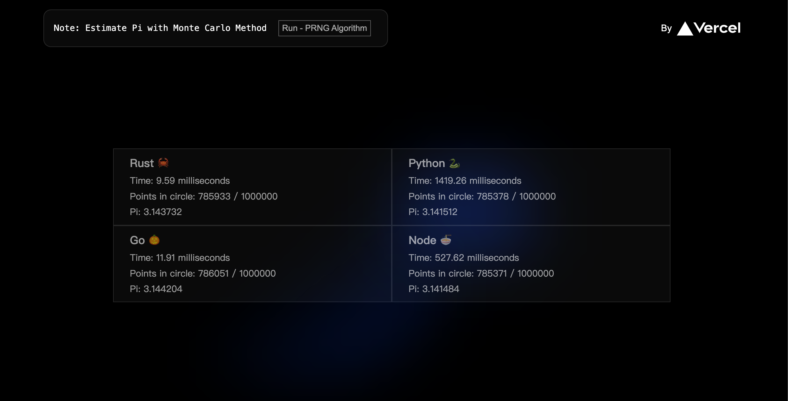

# next.stack

Proof of concept for building app with multiple serverless function on vercel

Validate multiple serverless functions and advantages of different technology stacks

Check out [Serverless Functions Overview | Vercel Docs](https://vercel.com/docs/concepts/functions/serverless-functions) for more details.

Initially, using src/app directory failed, serverless function API proxy  and custom directory support was not available. 
 
 
Therefore, I switched to a structure similar to the rust-runtime demo.
 and for now, I am testing WebAssembly.

  
 

## Deploy on Vercel

  <strong> ⚠️ NOTICE:</strong> Before deploying, it is essential to implement proper security restrictions, such as access authorization and request rate limiting

  
 

Or

  
 

Develop and test it, and then deploy it yourself

Check out [Deploying GitHub Projects with Vercel](https://vercel.com/docs/concepts/deployments/git/vercel-for-github) for more details.
